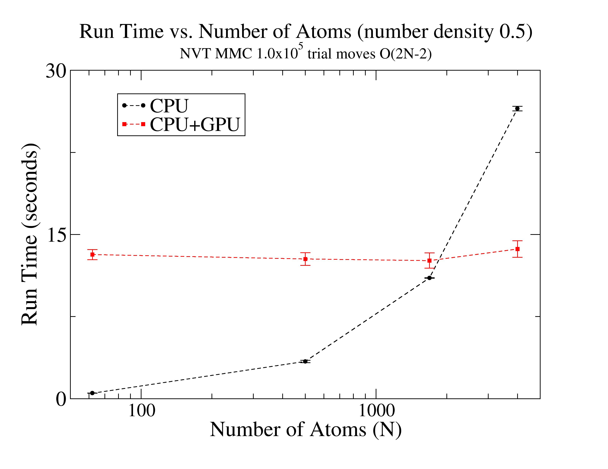

# Metropolis Monte Carlo simulation of Lennard-Jones systems.

This archived repository contains codes for simulating homogenous Lennard-Jones systems in the canonical (NVT) ensemble using the Metropolis Monte Carlo method. The codes were developed as a part of my research and training as a Ph.D. Student at UT Dallas (sometime between 2012 and 2016).

There are two versions of the simulation code, a serial version in c++ and a cuda parallelized version in c++ with CUDA/C:
  * pMC_HLJ_MIP_v1.0.cpp - serial version.
    * Compilation: `g++ -O2 pMC_HLJ_MIP_v1.0.cpp`
  * pMC_HLJ_MIP_v1.0.cu - cuda accelerated computation of the pair-wise interaction potentials. Also requires the thrust library.
    * Compilation (nvidia Tesla compute 3.5): `nvcc -O2 -arch=compute_35 pMC_HLJ_MIP_v1.0.cu`

### Performance comparison

### Simulation features/details:

  * Reduced Lennard-Jones units with sigma=1.0 and epsilon=1.0.
  * Standard 12-6 Lennard-Jones potential for pair-wise interactions.
  * Monte Carlo trial moves consiting of single atom translation in 3-dimensions.
  * Rectangular box simulation domain.
  * Periodic box conditions using the minimimum image convention.
  * Dynamic modulation of the trial move step size to achieve a target acceptance ratio of 33-55%.
  * Computes the average potential energy and heat capacity of the Lennard-Jones gas/fluid.

### Custom class objects

In addition to the main simulation codes, various custom class objects were implemented. These include:

  * `Atom` - class/Atom.h - a Lennard-Jones atom.
  * `Config` - class/Config.h - a configuration/collection of atoms.
  * `MTRandomNum` - class/MTRNG.h - an implementation of the 64-bit Mersenne Twister random number generator.
  * `RunningStats` - class/RunningStats.h - an object that dynamically computes running statistics for input variables as they are collected over time.
  * `Atom` - class_cuda/Atom-b.h - a variation of the Atom object for use with the cuda accelerated version of the simulation code.
  * `Config` - class_cuda/Config-b.h - a variation of the Config object for use with the cuda accelerated version of the simulation code.
  * `ConfigGPU` - class_cuda/ConfigGPU-c.h - a variation of the Config object with atoms allocated on the CUDA device for use with the cuda accelerated version of the simulation code.
  * `RunningStats` - class_cuda/RunningStats.h - a duplication of the class/RunningStat.h object.
